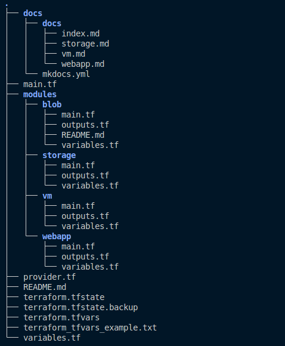

# **Project layout**

<div style="text-align: center;">



</div>


# **Explanation of the Different Steps for Creating Resources**

## **Setting Up Your Environment**:

Install Terraform and ensure you have access to the Azure CLI.
Configure your Azure account and set the necessary permissions to deploy resources.


## **Creating a Terraform Configuration File**:

Define the required provider (azurerm) in your **`provider.tf`** file, specifying the source and version.
Set up the provider configuration with your Azure subscription ID and other necessary settings.

```HCL
# Define the required Terraform providers
terraform {
  required_providers {
    # Specify the Azure Resource Manager provider
    azurerm = {
      source = "hashicorp/azurerm"
      version = "4.4.0"
    }
  }
}

# Configure the Azure Resource Manager provider
provider "azurerm" {
  # Configuration options
  features {

    # Configuration for virtual machine settings
    virtual_machine {
      detach_implicit_data_disk_on_deletion = false
      delete_os_disk_on_deletion            = true
      graceful_shutdown                     = false
      skip_shutdown_and_force_delete        = false
    }

  }

  # Specify the Azure subscription ID to use for resource management
  subscription_id = var.subscription_id
  
}
```

## **Defining Variables:**

Create a **`variables.tf`** file to define the required variables such as **resource_group_name**, **location**, **vm_name**, and others.
Assign values to these variables, either directly in the configuration file, through a **.tfvars** file, or via **environment variables**.

```HCL
# Define a variable for the resource group name
variable "resource_group_name" {
  # Description of the variable's purpose
  description = "The name of the resources group"
  
  # Specify the type of the variable as a string
  type        = string
}

# Define a variable for the Azure region where resources will be deployed
variable "location" {
  # Description of the variable's purpose
  description = "The Azure region to deploy resources"
  
  # Specify the type of the variable as a string
  type        = string
}
```

## **Creating Resources**:

Write the configuration for each resource you want to deploy:

* Virtual Machine (VM): Define the VM resource with attributes such as name, size, admin credentials, and network interface.
* Storage Account: Create a storage account to manage files and data.
* Blob Container: Set up a Blob Container within the storage account to store your files.
* Web App: Configure a Web App to expose your results or services.


## Running Terraform Commands:

Initialize your Terraform workspace using 

```bash
terraform init
```
Plan the deployment to see what resources will be created using terraform plan.

```bash
terraform plan -var-file="terraform.tfvars" 
```
Apply the configuration to deploy the resources with terraform apply.

```bash
terraform apply -var-file="terraform.tfvars"
```